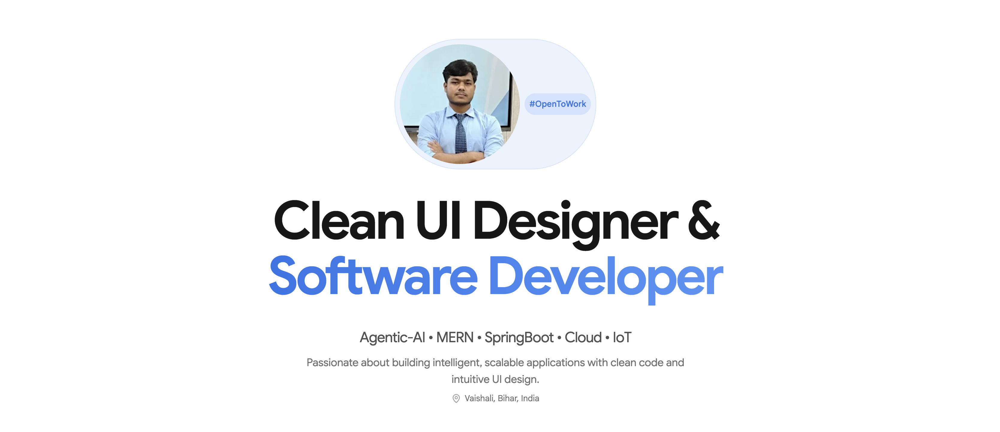

<table border="0" cellpadding="0" cellspacing="0">
    <tr>
      <td bgcolor="#1e1e2e" style="border-radius: 12px; padding: 10px 18px; border: 1px solid #313244;">
        &bull;
        &bull;
        &bull;
        
          @themdazad: ~/about me
        
      </td>
    </tr>
  </table>

    

---

### Full-Stack Developer

Welcome to my digital space! I am a passionate engineering student deeply invested in building scalable web ecosystems, exploring the crossroads of Agentic-IoT, and streamlining deployments with automation. I love converting ideas into interactive, optimized, and containerized applications.

---

## The Tech Stack 

| Category | Technologies |
| :--- | :--- |
| **Frontend** | React.js, Next.js, Vite, Tailwind CSS, JavaScript/TypeScript, shadcn/ui, GSAP,|
| **Backend** | Node.js, Next.js, Spring Boot|
| **DevOps & Infrastructure** | Docker, AWS (EC2, VPC), Linux/Terminal, Git/GitHub |
| **AI & Core Concepts** | Generative AI integration, Retrieval-Augmented Generation (RAG), System Prompting |
| **Languages & Core** | C++, Python, JavaScript, Java, Data Structures & Algorithms (DSA) |

---

## Featured Projects
